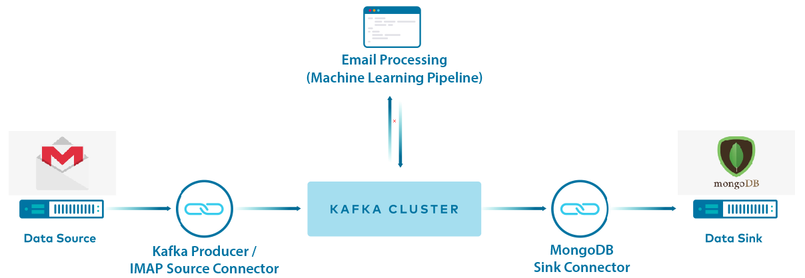

## Software Pipeline 

As shown from the pipeline above, emails can be accessed in one of two ways, either using a Kafka Producer or a Kafka Connector. 

**Note**: What was submitted as the software component uses Kafka connector. Please navigate to 'kafka-connect' folder to find a stand-alone demo on how to run the software with Kafka Connect (what we submitted).

The rest of the content within 'intelligent-email-app' repository has not been submitted and is an effort to improve the software. 

The improved software features:

- Kafka Producer which uses the Gmail API and OAuth authentication to access the users mailbox and emails, which is more flexible compared to Kafka Connector.
- Scheduler to fetch emails at an adjustable time interval e.g the mailbox can be checked every 30 minutes or 1 hour. This has been implemented this way because, when there are 0 unread messages, it does not make sense to keep checking the inbox again immediately and make unnecessary API calls. At each interval, any unread emails can be batched and processed together.
- MongoDB Atlas database deployed on Google cloud. Can access messages on Kafka using MongoDB Kafka Sink Connector. Messages on the database can be accessed and manipulated using PyMongo.
- LDA Machine Learning model, which has been optimised.

## TO-DO
* [ ] Connecting ML pipeline with Kafka pipeline.
* [ ] Deploying best ML model on the cloud database and using it for predictions.
* [ ] Search interface.
* [ ] Download search results as PDF.
* [ ] GUI interface.
* [ ] Complete software demo and documentation/

### To be continued...