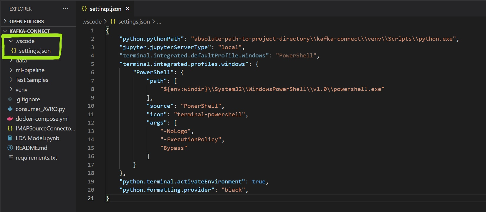
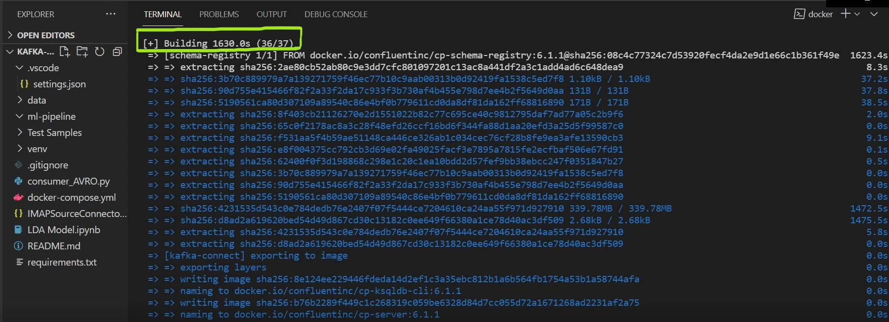

This is a stand alone demo of what was submitted. All necessary (submitted) files are within this (kafka-connect) folder.

The demo consists of:
- Accessing users mail inbox using the IMAP Kafka Connector.
- Sending the emails to Kafka.
- Consuming these emails from Kafka using a simple (AVRO) consumer. 

## Prerequisites:

Internet Connection

Python version 3

[Docker Desktop](https://docs.docker.com/desktop/) version 20.10.5 or later.
  - Includes Docker Engine, Docker CLI client and Docker Compose by default.

[Visual Studio Code](https://code.visualstudio.com/download) (Optional)


## How to run:

1. Open a terminal in vscode or command prompt, [set-up a python virtual environment](https://realpython.com/lessons/creating-virtual-environment/) in the root directory (Optional, Recommended).

    Run the following command to create a virtual environment called 'venv':
    ```python
    python -m venv venv
    ```

    According to vscode's new updates (as of April 2021), you may have to configure the following settings to automatically activate the virtual environment upon opening a terminal:

    


2. In the root directory, run the following command to install all required python libraries:
    ```python
    pip install - r requirements.txt
    ```

3. cd to the (root) directory where 'docker-compose.yml' file is present. 

4. The 'docker-compose.yml' file contains instructions and configurations of all the services required to run the software. The services include:

    - Confluent ZooKeeper
    - Confluent Kafka Broker
    - Confluent Schema Registry
    - Confluent Kafka Connect
    - Confluent Control Center
    - Confluent Rest Proxy
 
    Type and run the following command to pull each service's image from Docker Hub, create and start(run) it's container:

    ```yaml
    docker compose up
    ```

    

    Note: Starting these services for the first time will take a long time. Here, it took about 30 minutes to pull all the images specified in the 'docker-compose.yml' file.

    

5.  While waiting for all the services to start running, prepare the emails that need to be processed. 

    Important: Enable IMAP and turn on less secure app access from your gmail settings.

    By default, the Kafka connector will only check the unread emails within the 'INBOX' label in Gmail. 
    
    Hence, mark the emails you wish to process within the 'INBOX' label as unread.

6. All the services should be up and running now. Open Control Center on http://localhost:9021/. It can also be opened from docker desktop.
 
    Follow the gif below to create a test topic named 'email'.

    


7. Back in vscode, open 'consumer_AVRO.py' file and run it. At this point it might throw some errors/ warnings, since the broker doesn't have any messages yet. But let it run.

8. Configure the Kafka Connector settings.
    You can manually enter all the information by selecting the 'IMAPSourceConnector', alternatively like shown in the gif below, you can upload a connector config file. 

    The 'IMAPSourceConnector.json' file in this directory is the configuration file for this connector. It contains the basic infomation needed to access a IMAP mailbox, including the hostname, username, password, kafka topic to send to and more.

    

    Once the configuration is set, launch the connector. If successful, back in the topics/emails/messages section in the Control Center, the messages should start showing up. At the same time, as the consumer is continuously polling the 'email' topic, you should see the emails on the console when received by the consumer.

    Note: In this demo, we are only showing the consumer being able to consume messages from the Kafka broker and printing those messages on the console. However, in reality, instead of printing the message, it would be processed within a machine learning pipeline in real time, as shown in the main demo within the parent directory, 'intelligent-email-app'.
    
    If unsuccessful, you can debug using the Kafka-Connect logs from docker desktop, which can be accessed by simply pressing the Kafka Connect container.

9.  'LDA-Model.ipynb' notebook, has the model we used, tested on our custom dataset. It also has the implementation of saving the resulting emails as PDF's. 

10. [Link](https://github.com/JackaBoss/SEGP-Email-Database-System/tree/mondoDB-version-of-kafka) to database teams work on MongoDB database.

11. To stop the docker services press ```control c```, and to remove all the containers run:
    ```yaml
    docker compose down
    ```
    Note: removing the containers will cause all the data to be lost. Although, this data can be persisted by using docker volumes.

